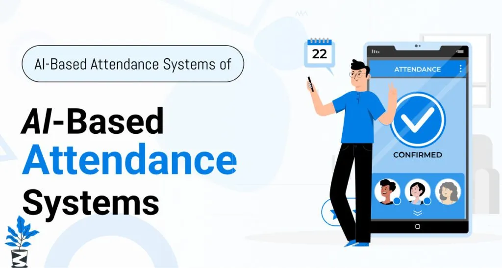

# 🤖 AI-Powered Attendance Management System


## 📌 Overview

This project is an **AI-powered attendance management system** designed to automate attendance tracking, analyze student attendance patterns, and predict low attendance risks using machine learning.

The system goes beyond traditional attendance tracking by integrating **data analytics and intelligent insights** to help improve student monitoring and decision-making.

---

## 🚀 Features

* ✅ Add and manage student records
* 📝 Mark daily attendance
* 📊 Visualize attendance data with charts
* 📈 Track attendance trends over time
* 🧠 Predict students at risk (attendance < 75%)
* ⚠️ Early warning system for low attendance
* 📁 Export attendance data (CSV)

---

## 🛠️ Tech Stack

* **Language:** Python
* **Libraries:** Pandas, NumPy, Scikit-learn, Matplotlib
* **Dashboard:** Streamlit
* **Database:** SQLite

---

## ⚙️ How to Run

### 1. Clone the repository

```id="db6waj"
git clone https://github.com/your-username/ai-attendance-system.git
cd ai-attendance-system
```

### 2. Install dependencies

```id="ow9rlu"
pip install pandas streamlit scikit-learn
```

### 3. Setup database

```id="f6nnzo"
python setup_db.py
```

### 4. Run application

```id="p1s0ac"
python app.py
```

### 5. Launch dashboard

```id="r3d31d"
streamlit run dashboard.py
```

---

## 📊 Output

* Student attendance records
* Attendance percentage visualization
* Bar charts showing present vs absent
* Alerts for low attendance

---

## 🎯 Future Enhancements

* 🤖 Face Recognition Attendance (OpenCV)
* 📩 Email/SMS alerts for low attendance
* ☁️ Cloud deployment (AWS / Azure)
* 📱 Mobile app integration

---



## 👩‍💻 Author

**Yashaswini T V**
AI & Machine Learning Enthusiast

---

## ⭐ Contribution

Feel free to fork this project and improve it!
